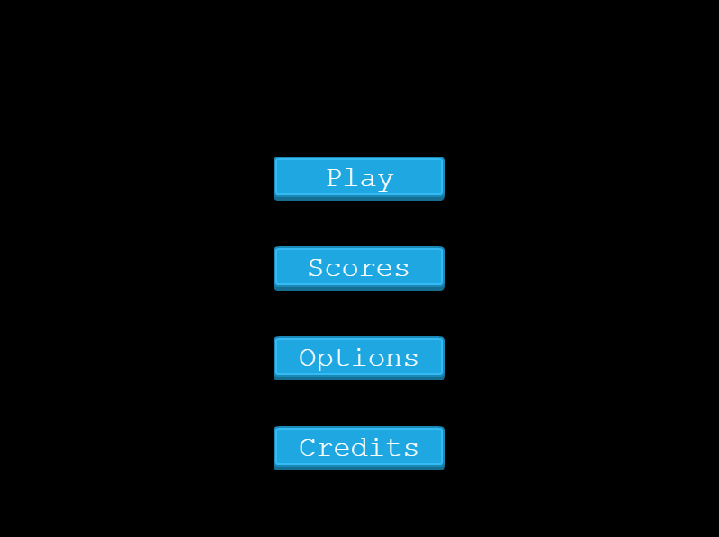
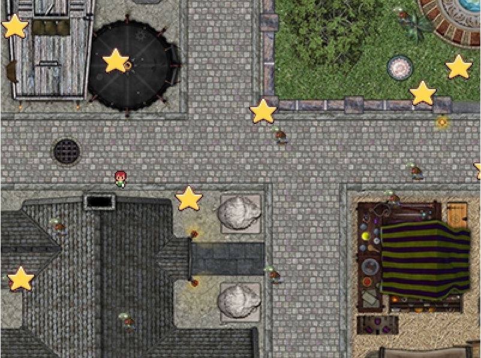
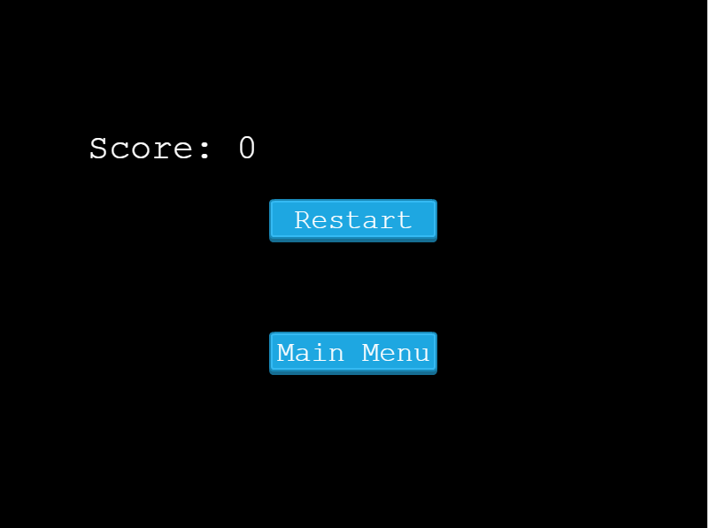

# Zombie attack


## Description

> Zombie attack is an RPG game that you can play directly from your browser without any prior installation. It was built using the Phaser 3 Game Framework & Javascript and compiled with Webpack.

## Game Design Document

[Game Design Document](./documentation.md)

## Library Directory 📙

| Contents                      |
| ----------------------------- |
| [Instructions](#instructions) |
| [Live Demo](#live-demo)       |
| [Screenshots](#screenshots)   |
| [Built With](#built-with-🛠)   |
| [Setup](#setup-⏳)            |
| [Testing](#testing-⚙️)        |
| [Authors](#authors)           |
| [License](#license)           |

## Instructions

You can control the player using a mouse and a keyboard. You can move around the map in all directions, holding a machine gun and shooting at the zombies.

To move the player:

- PRESS "UP" : To move UP
- PRESS "DOWN" : To move DOWN
- PRESS "RIGHT" : To move RIGHT
- PRESS "LEFT" : To move LEFT

## Live Demo

[Live demo](https://pensive-booth-4d035b.netlify.app/)

## Screenshots







## Built With 🛠

```
- Javascript
- Phaser 3 Game Framework
- Tiled Map Editor
- HTML
- CSS
- VS Code
```

## Setup ⏳

> Follow these steps to setup this web application locally :

1. - [ ] Open your `Terminal`.
2. - [ ] Navigate to the directory where you will like to install the repo by running `cd FOLDER-NAME`
3. - [ ] Run `git clone https://github.com/NtwaliHeritier/js-game` in the terminal.
4. - [ ] Run `cd js-game` to enter directory.
5. - [ ] Run `npm install` to install node packages and dependencies.
6. - [ ] Run `npm run start` in your browser to start the application.

## Authors

### 👨‍💻 NTWALI Heritier

[](https://github.com/NtwaliHeritier) <br>
[](https://www.linkedin.com/in/ntwaliheritier/) <br>
[](mailto:heritierntwali@gmail.com) <br>
[](https://twitter.com/ntwaliheritier)

### 🤝 Contributing

Contributions, issues and feature requests are welcome!

### Show your support

Give a ⭐️ if you like this project!

### License

